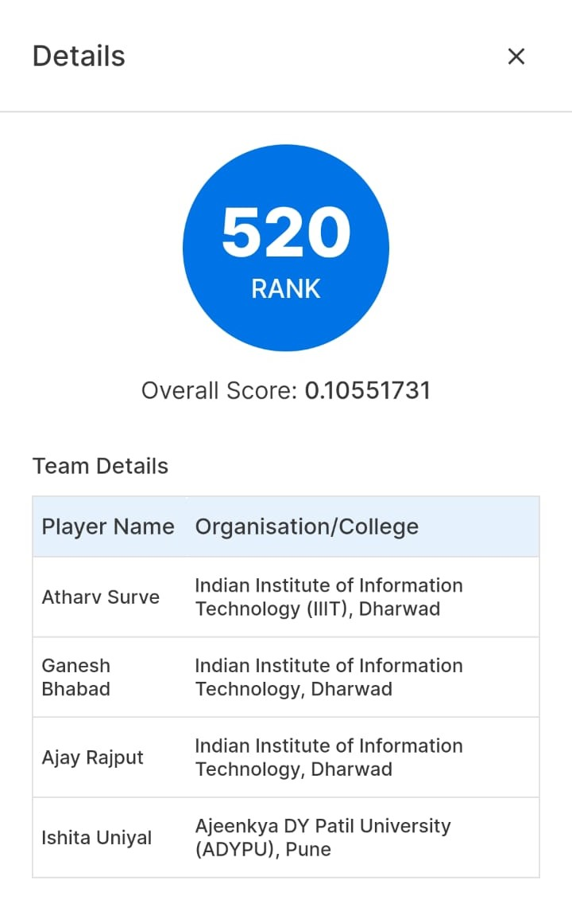

# Amazon-ML-Hackathon-Tensor-Titan
Amazon ML Hackathon 2024
# Scalable Text Extraction and Entity Mapping using LLM

## Overview

This project was developed as part of the **Amazon ML Hackathon 2024**, where our team participated in a national-level competition involving 20,000 teams from top institutions like IITs, NITs, IIITs, and other reputed national institutes. Our solution ranked **520th** out of the 20,000 teams. This hackathon focused on solving real-world problems using Machine Learning (ML) techniques.


Our project tackled the challenge of efficient and scalable **text extraction** from images using **EasyOCR** combined with GPU acceleration. Once extracted, the text underwent further processing for **entity mapping** using a **Large Language Model (LLM)**. The final output was a structured dataset identifying key entities such as dimensions, weight, voltage, and other attributes, mapped to their respective units.

## Team

- **Ganesh** - Team Lead
- **Ishita**
- **Atharv**
- **Ajay**

## Approach

Our approach consisted of multiple stages, each playing a crucial role in ensuring the scalability and efficiency of the text extraction and entity mapping tasks:

1. **Image Handling and Preprocessing**  
   Images were loaded, preprocessed, and deleted post-processing to conserve resources, ensuring fast and efficient handling using EasyOCR.

2. **Text Extraction with EasyOCR**  
   EasyOCR, accelerated by GPU, was employed to extract text from images, reducing processing time for large datasets.

3. **Data Preparation and CSV Generation**  
   Extracted text was integrated into a CSV format, creating a consolidated dataset for further processing by the LLaMA model.

4. **Entity Mapping and LLM Processing**  
   The LLaMA model performed entity classification, identifying key entities such as width, height, weight, and voltage. The BERT tokenizer was used to ensure proper text alignment for entity mapping.

5. **Model Training and Entity Prediction**  
   The model was trained on tokenized data to identify and classify entities. Once trained, the model was used to predict entities for unseen data, mapping values like dimensions and weight to their respective units.

6. **Final Output**  
   The final predictions were stored in a structured CSV format, ready for further analysis or integration into downstream applications.

## Files in the Repository

- `Extracting_image_text.ipynb` - Notebook handling image preprocessing and text extraction using EasyOCR.
- `LLM_Final_Code.ipynb` - Notebook detailing the implementation of the LLaMA model for entity mapping.
- `ML Hackathon Approach.pdf` - The project approach documentation.
- `README.md` - This README file.
- `demo.csv` - demo dataset with pre-existing data.
- `demo_extracted.csv` - Dataset containing the extracted text.
- `demo_final_prediction.csv` - Final output with predicted entities and mapped values.

## Getting Started

### Prerequisites

Ensure the following dependencies are installed:
- Python 3.x
- EasyOCR
- PyTorch (for GPU acceleration)
- pandas
- transformers (for the LLaMA model)
- BERT tokenizer

### Running the Project

1. Clone the repository:
   ```bash
   git clone https://github.com/your-repository-url.git

